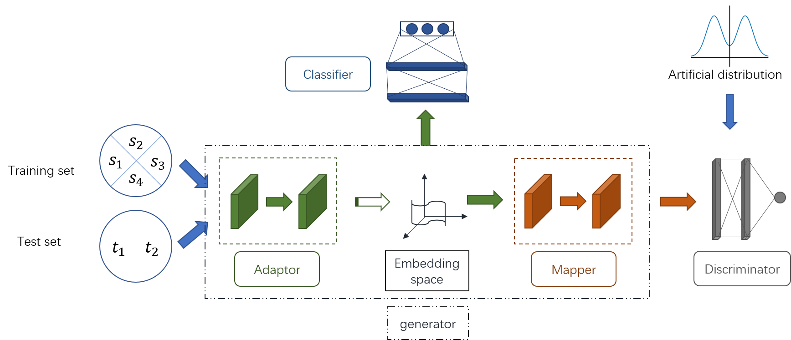
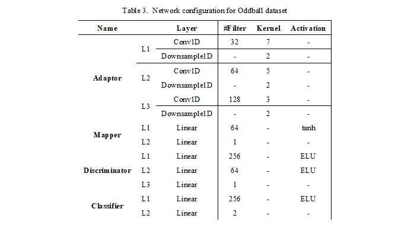

# san
This repo contains files for the subject adaptation network which is published on Applied Soft Computing.

It depends on the library dnn-lib, please download it as well and add it to the python path.

The architecture of the network is as follows:

It varies a little due to avoid infringing the copyright of the journal, since all related copyright is transferred.

The paper contains three experiments, so the corresponding codes reside in three folders.

Experiment 1

The first experiment demonstrates the feasibility of the idea, please refer to the journal paper for detail.
 

Experiment 3

Some readers made some enquiry about experiment 3, and the code is quickly refactored and uploaded here without check and test. Apologize if it has some problems since no time for subsequent work based on it.

1. The dataset is recently made public by the collaberating partners (https://www.ncbi.nlm.nih.gov/pmc/articles/PMC5712810/), and Prof. Dongrui shares the code for data preparation (preprocessBA_unbalanced.m). The script for generating the tfrecords are included as well, but may be a little messy.

2. All the network operations in refactored code is from the 1D perspective, so the configuration table is like as in the following image: 

(The uploading might extend some time due to the need for code cleanup.)
